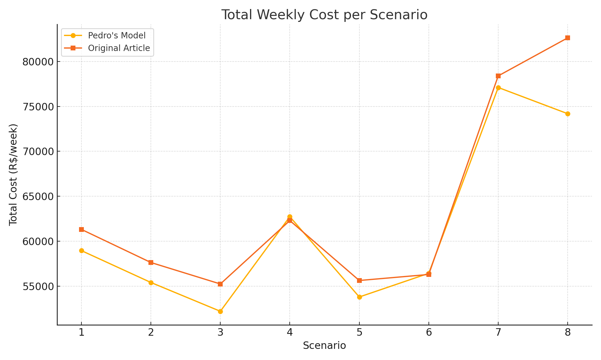

# Supply Chain Optimization Model

This repository presents a linear programming model implemented in Python using PuLP.
The model optimizes the location of distribution centers (DCs) and transportation flows in a two-stage supply chain supporting offshore platforms.

## 🔧 Tools

- Python 3.x
- PuLP (Linear Programming Library)
- Excel (input/output)

## 🧠 Problem Description

The model aims to minimize total logistics costs including:

- Fixed installation costs of DCs
- Operating costs of active DCs
- Transportation costs from suppliers to DCs and from DCs to offshore platforms
- Fulfillment of demand per platform
- Capacity constraints

## 📁 Project Structure

- `/code`: Python script implementing the optimization model
- `/data`: Input datasets
- `/results`: Scenario outputs and cost comparisons

## 🚀 Highlights

- Modular and reusable implementation
- Tested across multiple demand and capacity scenarios
- Fully executable with open-source tools

## 📊 Visual Comparison

Below is a comparison of the total weekly cost per scenario, contrasting this model's output with the original article results:

## 👤 Author

Pedro Silva  
[LinkedIn: www.linkedin.com/in/pedrolopessilva/]
